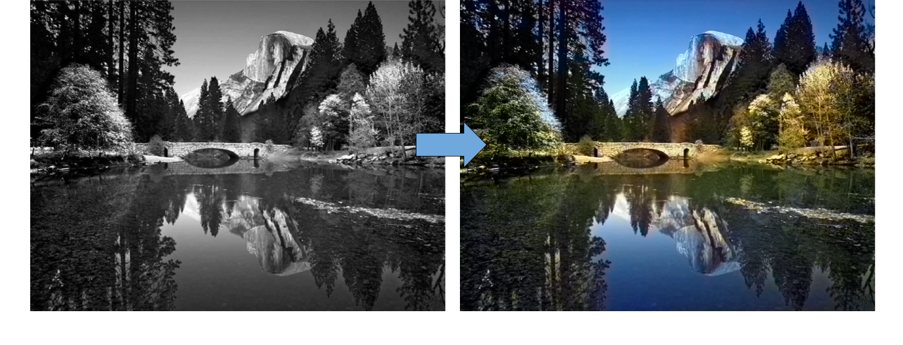

# Colorful Image Colorization

> Colorize any black and white image.

*From Zhang, R., Isola, P. and Efros, A. (2018). Colorful Image Colorization. Available [here](http://richzhang.github.io/colorization/)*



<p align="left">
  <a href="https://github.com/iitzco/deepzoo/releases/download/model-upload-7/zhang_colorization.zip">
    
  </a>
</p>

## Requirements

Run `pip install -r requirements.txt`

This will install `numpy` and `opencv`, which are it's only dependencies.

## How to run

Use `Colorant` class from `colorant.py`. 

The class can be used as shown in the following example:

```python
import cv2
from colorant import Colorant

img_path = "/path/to/my/b&w/image"

img = cv2.imread(img_path)

# OpenCV works with BGR images!
# Convert it to RGB first (although it's a BW image!)
img = cv2.cvtColor(img, cv2.COLOR_BGR2RGB)

proto_path = "/path/to/downloaded/prototxt/file"
model_path = "/path/to/downloaded/caffemodel/file"
hull_path = "/path/to/downloaded/pts_in_hull.npy/file"

colorant = Colorant(proto_path, model_path, hull_path)

img = colorant.run(img) # Receives and returns RGB image as numpy array

# OpenCV works with BGR images!
img = cv2.cvtColor(img, cv2.COLOR_RGB2BGR)

# Display image
cv2.imshow('image',img)
cv2.waitKey(0)
cv2.destroyAllWindows()

# Save image as well
cv2.imwrite("output.png", img)
```

## Model info

All information related to the model can be found [here](http://richzhang.github.io/colorization/).

## Comment

* We are using openCV's amazing `dnn` library that allows us to load Tensorflow, Caffe and Torch models. You can go [here](https://github.com/iitzco/OpenCV-dnn-samples) for more information.
* To understand all preprocessing done in `Colorant`, refer to this blogpost [here](https://www.learnopencv.com/convolutional-neural-network-based-image-colorization-using-opencv/)

